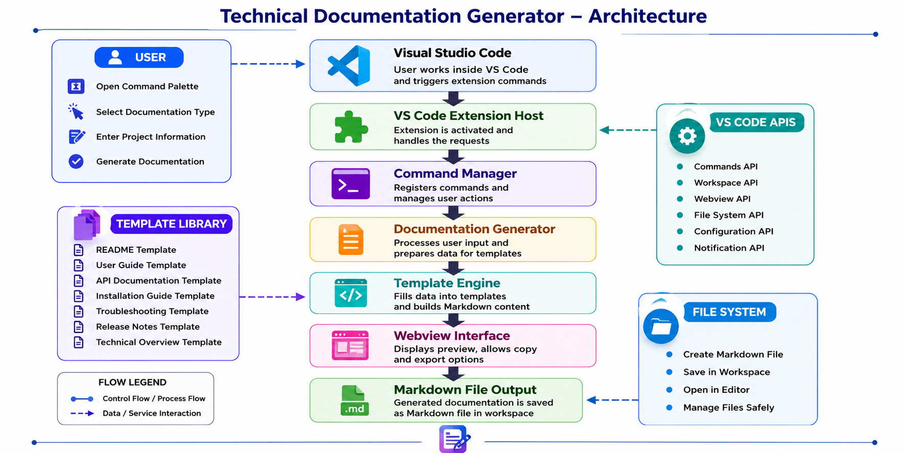

# Technical Documentation Generator

## Technical Overview

**Version:** 1.0

**Last Updated:** June 2026

## Table of Contents

- [Overview](#overview)
- [Purpose](#purpose)
- [System Architecture](#system-architecture)
- [Project Structure](#project-structure)
- [Technology Stack](#technology-stack)
- [Core Components](#core-components)
- [Documentation Generation Workflow](#documentation-generation-workflow)
- [Data Flow](#data-flow)
- [Command Execution](#command-execution)
- [File Generation Process](#file-generation-process)
- [Security Considerations](#security-considerations)
- [Performance Considerations](#performance-considerations)
- [Limitations](#limitations)
- [Future Improvements](#future-improvements)

## Overview

| Item | Value |
|------|-------|
| Project | Technical Documentation Generator |
| Document | Technical Overview |
| Version | 1.0 |
| Last Updated | June 2026 |
| Platform | Visual Studio Code |

This document provides a technical overview of the Technical Documentation Generator extension. It explains the overall architecture, major components, documentation generation workflow, project structure, and implementation approach used by the extension.

## Purpose

The Technical Documentation Generator is designed to simplify software documentation by generating standardized Markdown documents directly within Visual Studio Code.

The extension reduces repetitive documentation work while improving consistency across software projects. It enables developers and technical writers to generate common documentation templates without leaving the editor.

## System Architecture

The extension follows a modular architecture where Visual Studio Code acts as the host environment. User commands are processed through the extension host, validated, passed to the documentation generator, and converted into Markdown files that are saved in the current workspace.



## Project Structure

```text
technical-documentation-generator/
├── .vscode/
├── media/
├── src/
│   ├── commands/
│   ├── providers/
│   ├── templates/
│   ├── utils/
│   ├── extension.ts
│   └── webview.ts
├── package.json
├── tsconfig.json
├── README.md
└── CHANGELOG.md
```

The `src/extension.ts` file serves as the extension entry point, registering commands and managing the extension lifecycle. The `src/webview.ts` file is responsible for rendering the interactive user interface used to collect project information before generating documentation.

The project structure separates commands, reusable templates, utility functions, providers, and user interface components, making the extension easier to maintain and extend.

## Technology Stack

### Programming Language

- TypeScript

### User Interface

- HTML5
- CSS3
- VS Code Webview API

### Visual Studio Code APIs

- Extension API
- Commands API
- Workspace API
- File System API

### Development Tools

- Node.js
- npm
- Visual Studio Code
- Git
- GitHub

## Core Components

### Extension Host

Loads and manages the extension lifecycle inside Visual Studio Code.

### Command Manager

Registers commands and handles user actions initiated through the Command Palette.

### Documentation Generator

Processes user input and generates the selected documentation template.

### Template Engine

Creates standardized Markdown documents using predefined templates.

### Webview Interface

Displays interactive forms for collecting project information from the user.

### Workspace Manager

Creates and saves generated Markdown files within the current project workspace.

## Documentation Generation Workflow

The documentation generation process follows the workflow below.

```text
User
   │
   ▼
Command Palette
   │
   ▼
Extension Command
   │
   ▼
Interactive Input Form
   │
   ▼
Input Validation
   │
   ▼
Template Engine
   │
   ▼
Markdown Generator
   │
   ▼
Workspace File
```

Each step ensures that documentation is generated consistently using predefined templates and validated user input.

## Data Flow

Project information flows through the extension in the following order.

```text
User Input
      │
      ▼
Validation
      │
      ▼
Template Processing
      │
      ▼
Markdown Generation
      │
      ▼
File Creation
      │
      ▼
Project Workspace
```

All processing occurs locally within Visual Studio Code. No project data is transmitted to external services.

## Command Execution

The extension registers the following commands.

| Command | Command ID |
|---------|------------|
| Generate README | `techDocGen.generateReadme` |
| Generate User Guide | `techDocGen.generateUserGuide` |
| Generate API Documentation | `techDocGen.generateApiDocumentation` |
| Generate Technical Overview | `techDocGen.generateTechnicalOverview` |
| Generate Installation Guide | `techDocGen.generateInstallationGuide` |
| Generate Troubleshooting Guide | `techDocGen.generateTroubleshootingGuide` |
| Generate Release Notes | `techDocGen.generateReleaseNotes` |

Each command opens the appropriate documentation workflow, collects the required project information, and generates the selected Markdown document.

## File Generation Process

The extension generates documentation using the following process.

```text
Documentation Template
        │
        ▼
User Input
        │
        ▼
Input Validation
        │
        ▼
Template Rendering
        │
        ▼
Markdown Generation
        │
        ▼
File Creation
        │
        ▼
Workspace Folder
```

Generated files are saved directly inside the current project and can be edited immediately using Visual Studio Code.

## Security Considerations

The extension follows recommended Visual Studio Code extension security practices.

Security measures include:

- Local document generation
- Input validation
- Controlled command execution
- Safe file creation
- No external API communication
- No cloud storage of project data

## Performance Considerations

The extension is designed for lightweight execution.

Performance characteristics include:

- Fast documentation generation
- Minimal memory usage
- Local processing
- Efficient template rendering
- Low startup overhead

## Limitations

Current limitations include:

- Markdown output only
- Local file generation
- No cloud synchronization
- No collaborative editing
- No AI-assisted documentation generation
- Single workspace support

## Future Improvements

Future releases may include:

- AI-assisted documentation generation
- Custom documentation templates
- PDF export
- DOCX export
- Multi-language support
- Git integration
- Documentation version history
- Template marketplace
