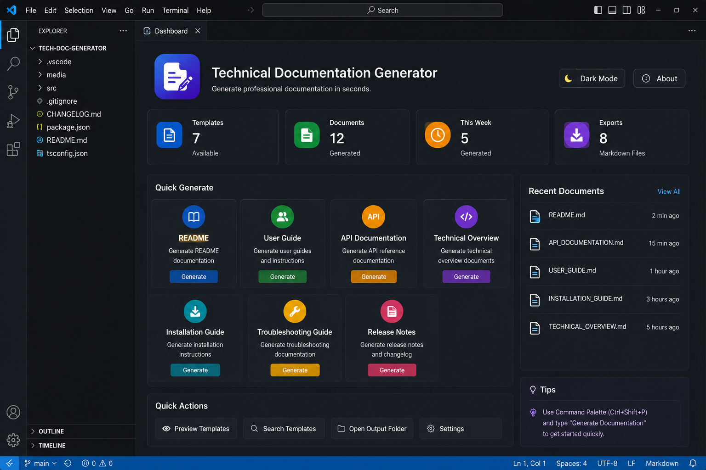

# Technical Documentation Generator



# User Guide

**Version:** 1.0

**Last Updated:** June 2026

## Table of Contents

- [Introduction](#introduction)
- [Getting Started](#getting-started)
- [Extension Overview](#extension-overview)
- [Installation](#installation)
- [Launching the Extension](#launching-the-extension)
- [User Interface](#user-interface)
- [Generating Documentation](#generating-documentation)
- [Available Templates](#available-templates)
- [Generated Output](#generated-output)
- [Managing Generated Files](#managing-generated-files)
- [Tips & Best Practices](#tips--best-practices)
- [Troubleshooting](#troubleshooting)
- [Frequently Asked Questions](#frequently-asked-questions)

## Introduction

The Technical Documentation Generator is a Visual Studio Code extension that helps developers and technical writers generate standardized software documentation directly within Visual Studio Code.

The extension simplifies documentation by providing ready-to-use templates for common project documents, reducing manual effort while maintaining consistency across software projects.

## Getting Started

Before using the extension, ensure that:

- Visual Studio Code is installed.
- The Technical Documentation Generator extension is installed.
- A project folder is opened in the current workspace.

## Extension Overview

The extension provides templates for the following documentation types:

- README
- User Guide
- API Documentation
- Technical Overview
- Installation Guide
- Troubleshooting Guide
- Release Notes

Each template is generated in Markdown format and can be customized after generation.

## Installation

1. Open Visual Studio Code.
2. Open the Extensions Marketplace.
3. Search for **Technical Documentation Generator**.
4. Click **Install**.
5. Restart Visual Studio Code if prompted.

## Launching the Extension

Launch the extension using the Command Palette.

**Windows / Linux**

```text
Ctrl + Shift + P
```

**macOS**

```text
Cmd + Shift + P
```

Search for the desired documentation command and press **Enter**.

## User Interface

The extension dashboard includes:

- Documentation Templates
- Recent Documents
- Quick Actions
- Search Templates
- Settings


## Generating Documentation

To generate documentation:

1. Open the Command Palette.
2. Select a documentation template.
3. Enter the required project information.
4. Review the generated content.
5. Save the Markdown document.

## Available Templates

| Template | Description |
|----------|-------------|
| README | Project overview and setup instructions |
| User Guide | End-user documentation |
| API Documentation | REST API reference |
| Technical Overview | System architecture and implementation details |
| Installation Guide | Setup and installation instructions |
| Troubleshooting Guide | Common issues and solutions |
| Release Notes | Product release summary |

## Generated Output

Generated documentation:

- Uses Markdown format
- Is compatible with GitHub
- Can be edited manually
- Supports version control
- Follows a consistent document structure

## Managing Generated Files

Generated documentation can be:

- Saved inside the current project
- Edited in Visual Studio Code
- Added to Git repositories
- Shared with team members
- Published with project documentation

## Tips & Best Practices

For the best experience:

- Review generated content before publishing.
- Keep project information updated.
- Store documentation inside the repository.
- Use consistent naming conventions.
- Update documentation whenever the project changes.

## Troubleshooting

| Issue | Solution |
|--------|----------|
| Command not found | Reload Visual Studio Code and verify the extension is installed. |
| Extension not activated | Restart Visual Studio Code. |
| Markdown file not generated | Ensure a project folder is open in the current workspace. |
| Generated content requires changes | Edit the generated Markdown file manually. |

## Frequently Asked Questions

### Which documentation templates are available?

README, User Guide, API Documentation, Technical Overview, Installation Guide, Troubleshooting Guide, and Release Notes.

### Where are generated files saved?

Generated files are saved inside the currently opened project workspace.

### Can I edit generated documentation?

Yes. All generated Markdown files can be modified after generation.

### Does the extension require an internet connection?

No. Documentation is generated locally.

### Can I use the generated documentation on GitHub?

Yes. The extension generates standard Markdown files that are fully compatible with GitHub.
